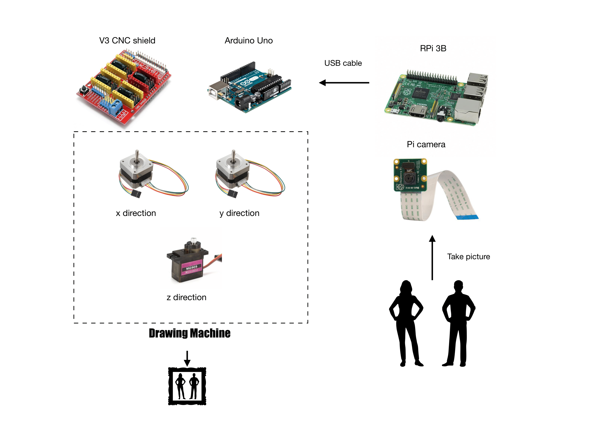

# Real-time-Picture-Drawing-Machine

This is an open source project for a picture drawing CNC machine.
We build this system with the help of these repos:
+ [Edge Detection](https://github.com/krshrimali/Deep-Learning-based-Edge-Detection)
+ [gcode-cli](https://github.com/hzeller/gcode-cli)
+ [grbl-servo](https://github.com/robottini/grbl-servo)


The demo video can be found [here](https://www.youtube.com/watch?v=XFeANVEaMYw)

## Instruction

### Take Picture
```
sh run.sh <picture> <picture_transform>
```
Push the button and wait for 3 seconds to take the picture

### Transform
Use [Inkscape](https://inkscape.org) to transform the picture into gcode.

### Drawing
```
sh draw.sh <gcode> <gcode_modified>
```
